# データベース
- 表でデータを管理する
- 表のことを「テーブル」という
- 縦の列のことを「カラム」、横の行のことを「レコード」という
- データベースは必要に応じて複数のテーブルを作成できる
- データベースへの命令（クエリ）に、SQL言語を使う。

## SELECT
- SELECTを使って、どのカラム（列）からデータを取得するか選択する

```sql
SELECT name
```
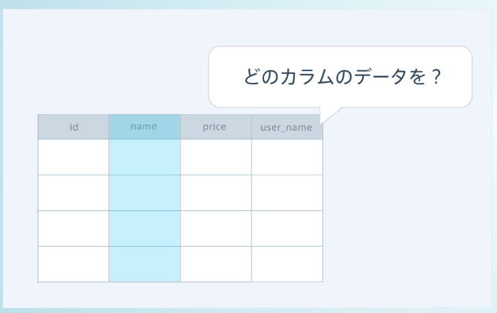

## FROM
- FROMを使って、SELECTで選択したカラムが「どのテーブルのカラムか」を指定する必要がある

```sql
SELECT name
FROM purchases; # クエリの最後
```
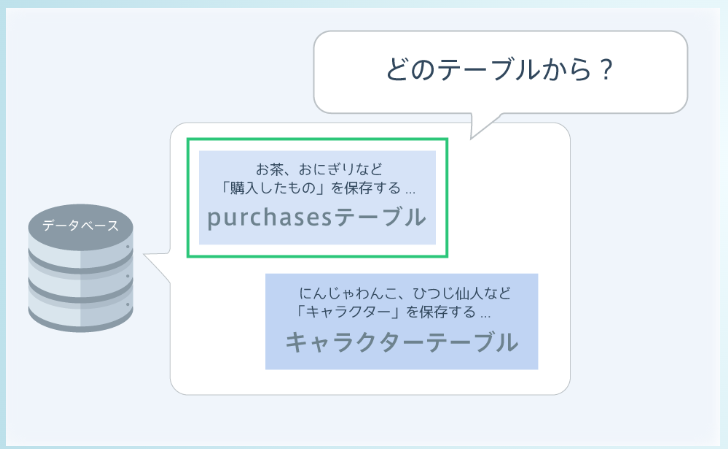


## 複数のカラムを選択する

```sql
SELECT name, price # 特定のカラムを取得
SELECT *           # 全カラムのデータを取得
```


## WHERE
- 「どこの」という意味を持つ「WHERE」を用いると、特定のデータを取得できる
- SELECT, FROMで「どのテーブルのどのカラムのデータを取得するか」までは決まっている。
- WHEREを使って、「どこのレコード（横）を取得するか」を決める。
- 下の例は、categoryが食費であるデータのみを取得している例

```sql
SELECT *
FROM purchases
WHERE category="食費"; # 食費のようなテキストは""で囲む必要がある
```
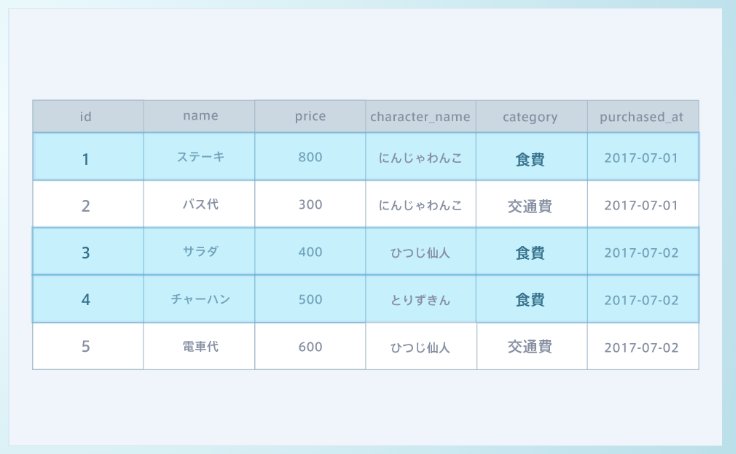


## データ型
- データベースに保存されているデータには、「データ型」と呼ばれるルールがある
- データ型とはテキストデータ、数値データ、日付データといったデータの種類を示すもの
- 例えば、数値データはWHEREで指定する時に""で囲む必要はない
- 一方、テキストデータ、日付データを指定するときは""で囲む必要がある

## 比較演算子
- WHEREの条件では比較演算子を使って、大小比較を行い、例えば、「priceカラムが1000以上であるレコード」などを取得することができる。比較演算子はpython, jsと同じ。


## LIKE演算子
- 「ある文字を含むデータ」を取得したい場合は、「〜のような」という意味を持つLIKE演算子を用いる。

```sql
SELECT *
FROM purchases
# WHERE name LIKE 文字列;
# WHERE name LIKE "%プリン%"; # %をワイルドカードという。これによりプリンを含むデータを全て取得する。
```

## ワイルドカード

```sql
WHERE name LIKE "プリン%" # 前方一致 プリンで始まるデータと一致
WHERE name LIKE "%プリン" # 後方一致 プリンで終わるデータと一致
```

## NOT演算子
- 〇〇を含まないデータや〇〇に一致しないデータのような条件でデータを取得したい場合は否定を意味するNOT演算子を用いる

```sql
SELECT * FROM purchases
WHERE NOT price = 1000;
WHERE NOT name LIKE "%プリン%";
```
## NULL
- 何のデータも保存されていない場合にNULLとなる
### NULLのデータとそうでないデータを取得する方法

```sql
SELECT * FROM purchases
WHERE price IS NULL;     // ○
WHERE price IS NOT NULL; // ○
WHERE price = NULL;      // ☓
WHERE NOT price = NULL;  // ☓
```

## AND, OR演算子
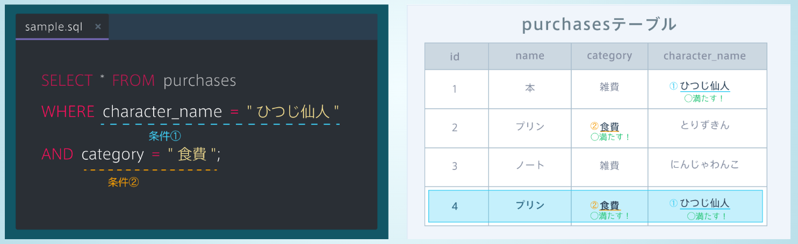
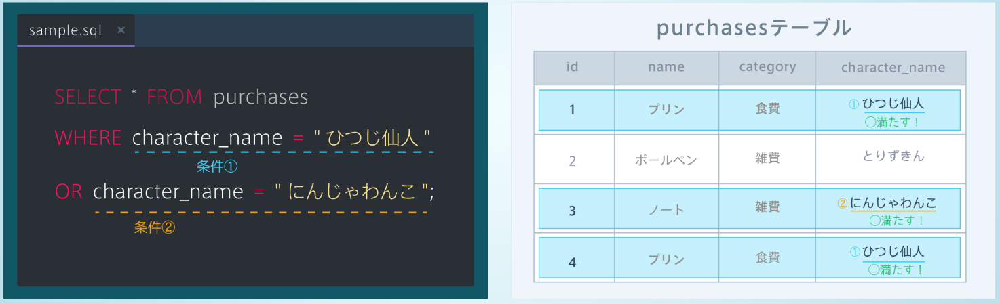


## データを並び替える ORDER BY
- ORDER BY 並べ替えたいカラム名 並べ方;
- 並べ方には、昇順, 降順を意味するAscending, Descendingの頭文字をとって、ASC, DESCを用いる。

```sql
SELECT * FROM purchases
ORDER BY price DESC; # priceを降順に並べる
ORDER BY price ASC; # priceを降順に並べる
```


## 必要な数だけデータを取得する　LIMIT
- LIMIT num_dataで上からnum_data件だけのデータを取得できる


## 検索結果を加工する
### DISTINCT
- 検索結果から超複するデータを除くことができる
- DISTINCT(カラム名)とすることで検索結果から指定したカラムの重複するデータを除くことができる

```sql
SELECT DISTINCT(name) FROM purchases;
```

### 四則演算

```sql
カラム名 * 1.10
カラム名 - 1000
```

## 集計関数を使う
### SUM, AVG, COUNT
- SUM -> 合計
- AVG -> 平均
- COUNT -> データの数
    - NULLのデータは計算に含めない
    - COUNT(price)だと、price列のNULL以外のデータの件数を計算している。
    - COUNT(*)とすることで、特定のカラムのデータ数ではなく、レコードの数を計算する。nullを含めて計算する。
- MAX, MIN -> 最大、最小

```sql
SELECT SUM(price) # 検索したレコードの数値の合計を計算
FROM purchases # purchasesテーブルを検索
WHERE character_name = "Naruto"; # Narutoのレコードを検索
```


## データをグループ化する
### GROUP BY
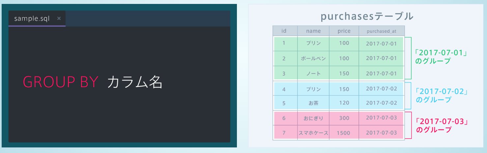
- **注意点として、GROUP BYを用いる場合、SELECTで使えるのは、GROUP BYに指定しているカラム名と集計関数のみであること**

```sql
SELECT SUM(price), purchased_at # これは問題ない
# SELECT price, purchased_at # これは問題!
FROM purchases
GROUP BY purchased_at
```

### WHEREとGROUP BY
- WHEREで検索して、GROUP BYでグループ化して、集計関数でデータをまとめる
- この順番を知っておく
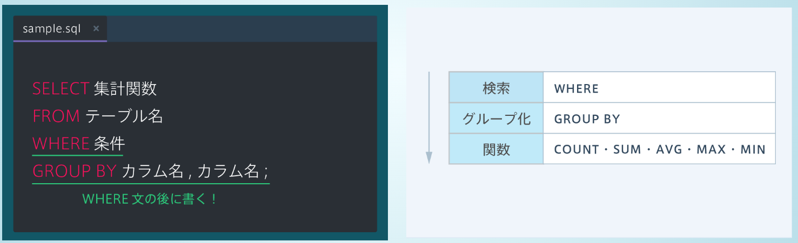


### HAVING
- GROUP BYでグループ化したデータを更に絞り込みたい場合は、HAVINGを使う。
- GROUP BY カラム名 HAVING 条件　のようにすることで、条件を満たすグループを取得できる

### WHEREとHAVING(SQLの実行順を意識せよ)
1. 検索　WHERE
2. グループ化 GROUP BY
3. 関数　COUNT, SUM, AVG, MAX, MIN
4. HAVING

#### WHEREとHAVINGの違い
- WHEREはグループ化される前のテーブル全体を検索対象とする
- HAVINGはGROUP BYによってグループ化されたデータを検索対象とする
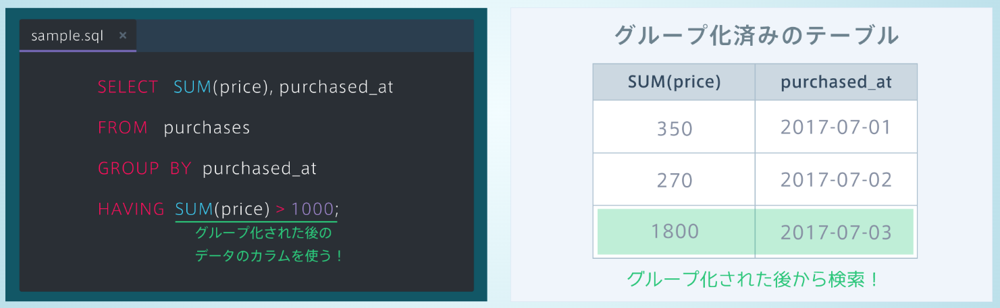


## サブクエリ
- クエリの中にクエリを入れることができる
- クエリの中に入るクエリをサブクエリという
- 下のコードは、Akihiroよりもゴール得点が高い選手名を取得する例

```sql
SELECT name
FROM players
WHERE goals > (
    SELECT goals
    FROM players
    WHERE name = "Akihiro"
);
```


## AS
- ASを使うことでカラム名などに別名を定義することができる
- カラム名 AS "名前" でカラム名に定義する名前を指定する


## テーブルの結合　
### テーブルが紐づく仕組み
- テーブルを紐付けるためには、外部キーと主キーを使う。
- 外部キーで他のテーブルにある主キーを指定することで、テーブル同士を紐付けることができる
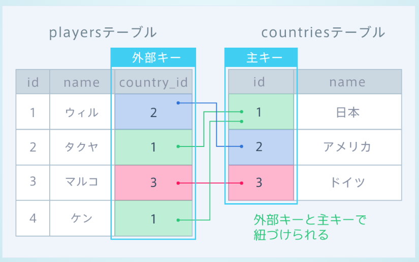

### テーブルの結合
- JOINを使う　
- 結合したテーブルは１つのテーブルと同じようにデータを取得することができる
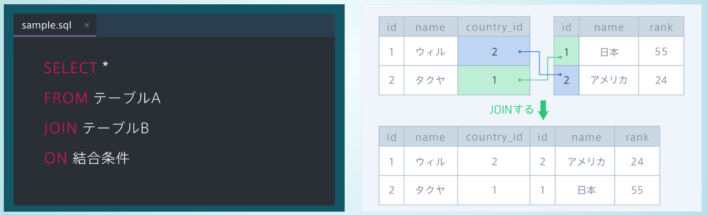

### 結合条件
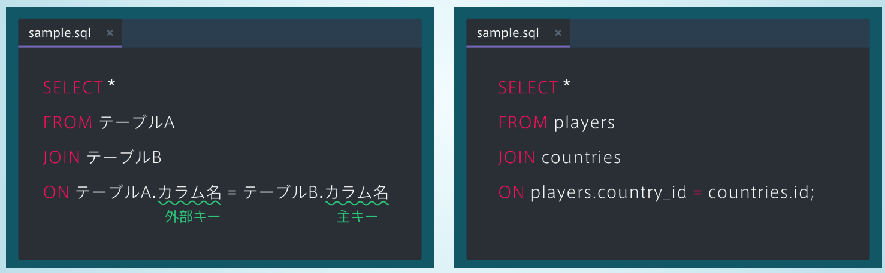

### JOINの実行順序
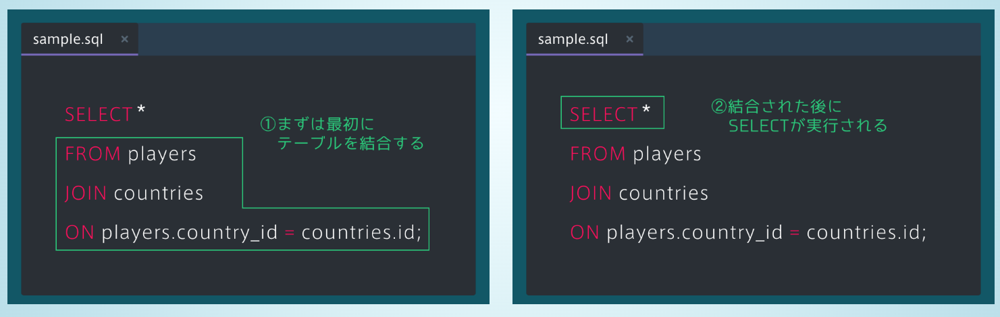


### 複数テーブルでのカラムの指定
- 複数のテーブルに同じカラム名が存在するときは、テーブル名.カラム名で指定すればいい

```sql
SELECT players.name, countries.name
FROM players
JOIN countries
ON players.country_id = countries.id;
```


## 全体実行順序
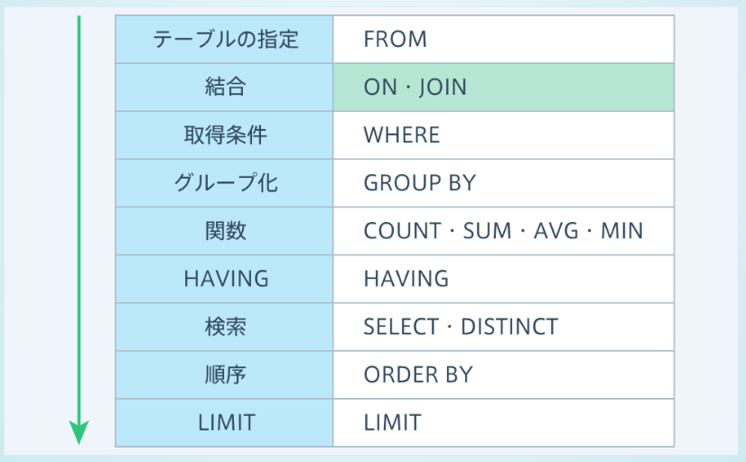


## NULLを含んだテーブルの結合
- 外部キーがNULLのレコードは、実行結果に表示されない
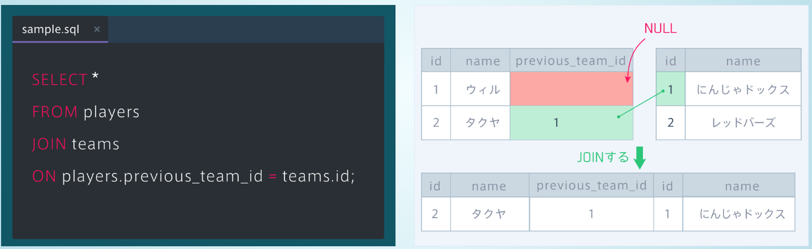


## LEFT JOIN 
- LEFT JOINを使うと、FROMで指定したテーブルのレコードを全て取得する。外部キーがNULLのレコードもNULLのまま実行結果に表示される
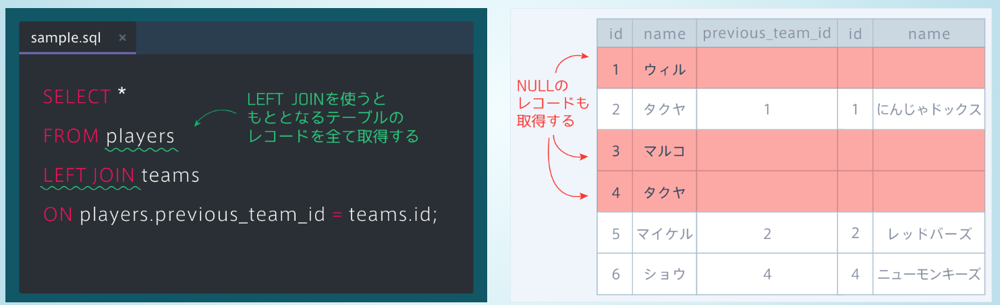


## ３つ以上のテーブル結合　
