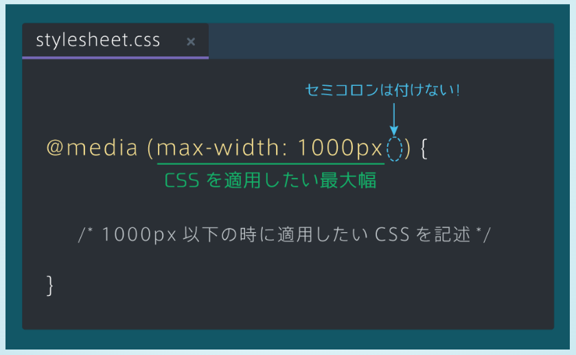
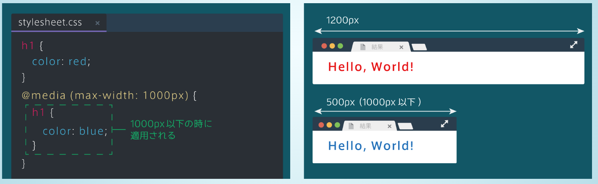
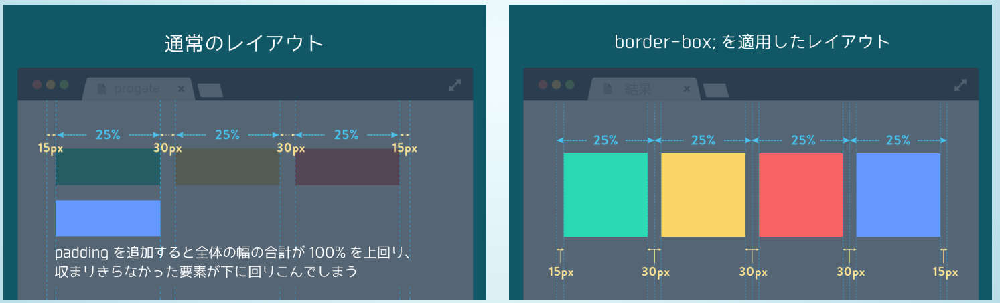
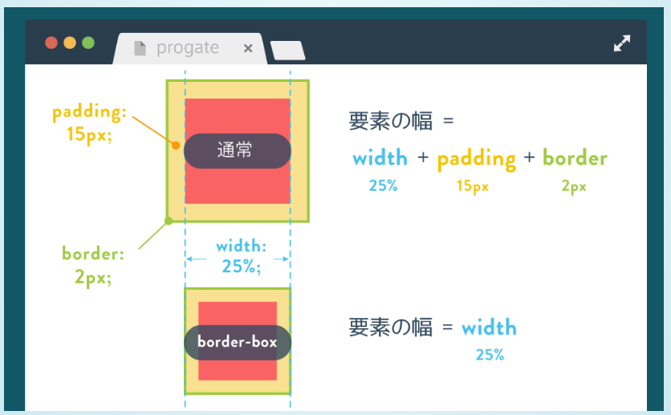
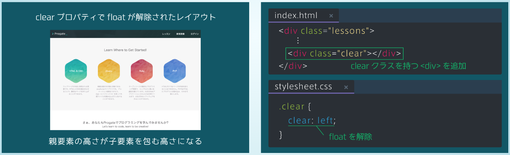
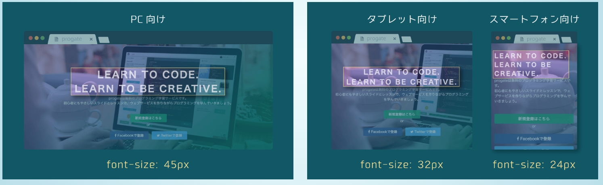
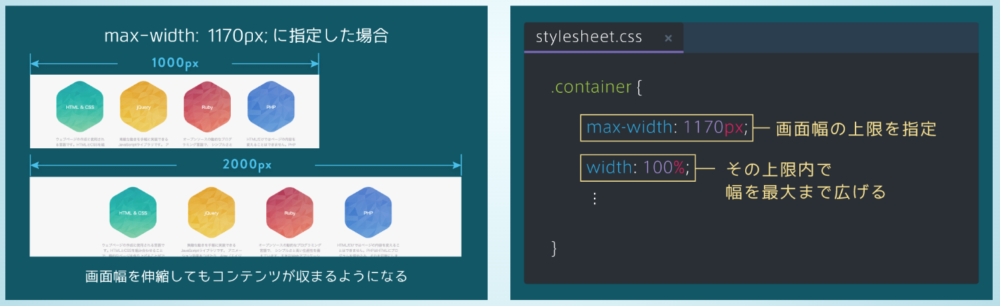
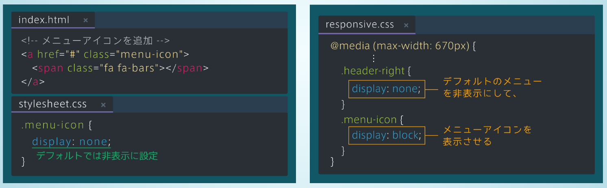

# レスポンシブデザイン
## メディアクエリ Media Queries
- ブラウザの画面サイズに応じてCSSのスタイルを設定できる手法

## 書き方
- @media(条件){...} 指定された条件が当てはまる時にのみ{...}が適用される

- max-width, min-widthを条件として指定できる

- max-width: 「~~px」←　ここのことをブレイクポイントと呼ぶ

## レイアウト崩れを解消する
- box-sizing: border-box;　とする
- その結果、要素の幅widthにpadding, borderが含まれるようになるため、padding, borderを追加したときに生じるレイアウト崩れを未然に防ぐことができるのだ。
- box-sizing: border-box;を指定するときは、*に対して指定することが推奨されている
- *は全ての要素に対してCSSを適用したい場合に用いる
- border-boxを全ての要素に対して適用することで、レイアウトを管理しやすくなる。

## レスポンシブデザインの型を準備する
- レスポンシブデザインを適用する準備として、<head>タグ内にviewportを設定する
- viewportを設定しないと、スマホやタブレットでの閲覧時にメディアクエリが正しく機能しない

## floatと親要素の高さ
- 通常、親要素の高さは子要素を包む高さとなる
- しかし、子要素がすべてfloatのとき、親要素の高さは0になってしまうという性質がある
- これは、floatが浮いているという意味で、親要素から見るとfloatの子要素は存在しないように見えるから
- floatの解除をする必要がある
- 子要素が全てfloatでも、親要素が高さを持つように設定する
- floatは、clear: left;で「浮いている」状態を解除できる
- **clear: left;を適用するためだけの空のタグを用意する。**
- 空タグとclearでfloatの解除をするのはよく使うテクニック

## フォントのレスポンシブ化
- 画面幅が小さいときは、フォントサイズを小さくしたほうが読みやすくなる

## 画面サイズが大きいときに対応する　
- container要素のwidthが100%のため、画面幅が2000pxなどとても大きいときも画面いっぱいに広がってしまう
- max-width: px;と指定することで、画面幅が拡大しても、要素の幅の上限が指定したpxサイズになる

## ヘッダーメニューを画面サイズに応じて切り替える
- スマホでは、ヘッダーメニューを表示しきれないため、メニューをアイコンに変更する
- メニューアイコンはデフォルトで非表示にして、画面幅が670px以下のときにのみ表示されるようにする
- 要素の非表示　→　display: none;
- 非表示にした要素を表示する　→　display: block;

