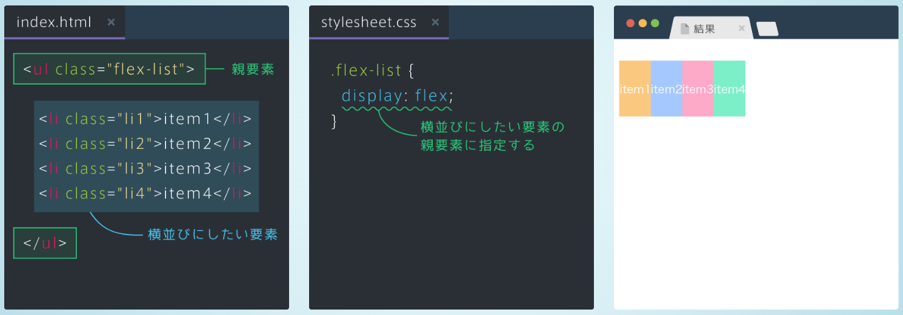
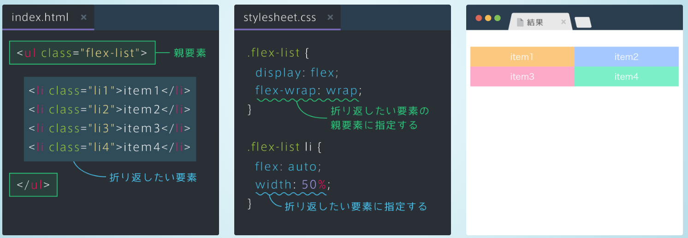
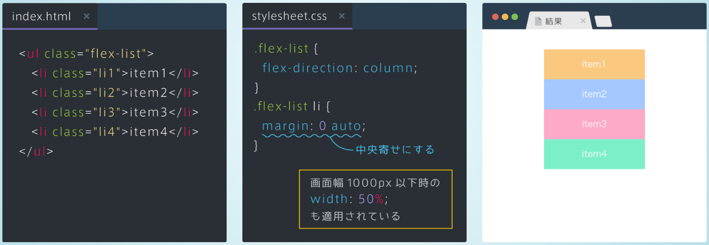

# 要素を横並びにする
- 横並びにしたい要素の親要素にdisplay: flexを指定する

# 要素を横いっぱいに広げる
- flex: autoを指定する

# 要素を二列に折り返す　
- flex-wrap: wrapを指定すると、「子要素のサイズ」に応じて折り返すことができる。

# 画面幅を狭めたときに一列に並ぶようにする　
- flex-direction: columnは子要素を上から下へ並べる（何も指定しないと、左から右へ並ぶ）
- 縦に並べたい要素の親要素にflex-direction: columnを指定する。

# ブロック要素の中央寄せ
- margin: 0 autoと指定する

