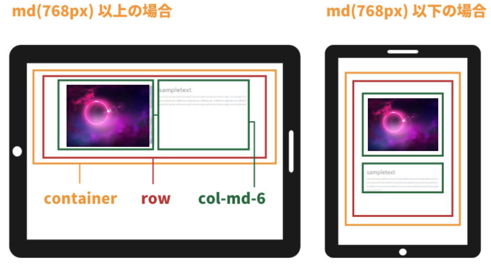

# Bootstrapのグリッドを理解する。
- 参照：[Bootstrapのグリッドを理解する](https://skillhub.jp/courses/168/lessons/915)
## Bootstrapの中身
- Bootstrapでは、ボタンやメニューなど様々なパーツが予め用意されている。
- Bootstrapが用意してくれているクラスなどを指定することで簡単にデザインを作成することができる。
- 例えば、以下のようにBootstrapがボタンの色を用意しているため、class属性に"btn-primary"と指定するだけで青の背景に白文字のボタンが完成する。
```css
.btn-primary{
    color:#fff;
    background-color:#007bff;
    border-color:#007bff;
}
```
```html
<button class="btn-primary">
```
- Bootstrapでは、レスポンシブデザインに最適な「グリッドシステム」というものが用意されている。つまり、レスポンシブの為のCSSが予め用意されている。

## グリッドシステム
- Bootstrapには、グリッドという仕組みがある。
- デバイス画面を12分割し管理する仕組みのこと
- 12分割されたグリッド上に沿うように、コンテンツを配置していきデザインを整える。


## ブレークポイント
- レイアウトが変わる基準となる幅
- extra small, small, medium, large, extra largeがある
- 画面幅は[ドキュメント](https://getbootstrap.jp/docs/5.3/layout/breakpoints/#%e5%88%a9%e7%94%a8%e5%8f%af%e8%83%bd%e3%81%aa%e3%83%96%e3%83%ac%e3%83%bc%e3%82%af%e3%83%9d%e3%82%a4%e3%83%b3%e3%83%88)を参照

## レイアウトのためのCSS
- Bootstrapでは"container"というCSSクラスが用意されている。
- これはコンテンツを入れる入れ物のようなもの
- また、中に入れるコンテンツを画面中央に配置する。
- htmlファイル内に以下のように記述する。
```html
<div class="container">
    コンテンツ
</div>
```
- containerのCSSは以下のようになっている。
    - 画面幅が小さくなるとコンテナの幅も小さくなる。
```css
.container { 
    padding-right: 15px; 
    padding-left: 15px; 
    margin-right: auto; 
    margin-left: auto; 
} 

@media (min-width: 768px) { 
    .container { 
        width: 750px; 
        } 
    } 

@media (min-width: 992px) { 
    .container { 
        width: 970px; 
        } 
    } 

@media (min-width: 1200px) { 
    .container { 
        width: 1170px; 
        } 
    }
```
- また、Bootstrapでは"container-fluid"というCSSが用意されている。
- こちらは、width:100%と指定したときのように、横幅はどのデバイスでも画面幅全体となる。
```html
<div clsas="container-fulid">
    コンテンツ
</div>
```

## rowクラスで行の設定
- 横並びにしたいコンテンツが有るときに、それらをこのrowクラスで囲うという使い方をする
```html
<div class="container">
    <div class="row">
    </div>
</div>
```
- 必ずしもcontainerの中に入れる必要はない

## col
- カラムとは12分割した列のことをいう
- colの後にブレークポイントとカラム数指定の記述を加える
- 例えば、画面幅が768px以上の時、コンテンツの幅は6カラム（グリッド）分にしたいとする（下のコード参照）
```html
<div class="container">
    <div class="row">
        <div class="col-md-6">
        </div>
    </div>
</div>
```
- col-ブレークポイント-カラム数
- ブレークポイント部分には以下のクラス名を書く
- 
|        | extra small | small         | medium        | large          | extra large | 
| ------ | ----------- | ------------- | ------------- | -------------- | ----------- | 
| 画面幅 | ~ 575px     | 576px ~ 767px | 768px ~ 991px | 992px ~ 1199px | 1200px ~    | 
| クラス名 | なし | sm | md | lg | xl |

- col-md-6の意味は、768px以上のときは6カラムとし、767px以下の画面幅になったときは12カラム分の横幅に広がる。
- 12カラムということは、一列になるということ
- これは、どんなカラム数を指定したとしても、指定された画面幅以下の場合は12カラムの幅になるようにBootstrapのCSSに記述されているため。
### 横並びで複数のコンテンツを並べて配置する場合
```html
<div class="container">
    <div class="row">
        <div class="col-md-6">content1</div>
        <div class="col-md-6">content2</div>
    </div>
</div>
```

