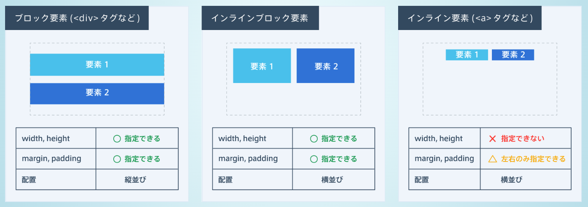
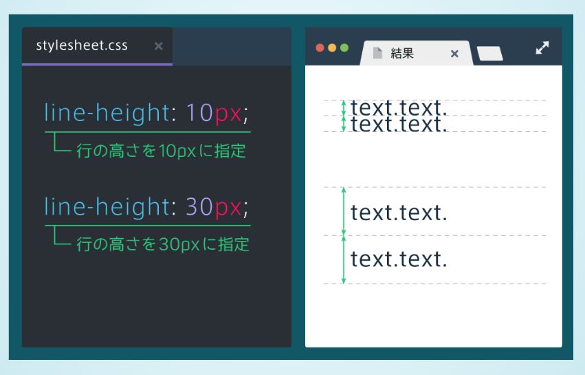

# header, footer
- class属性にheader, footerを指定するよりも、header, footerタグを使うほうが一般的。
```html
<div class="header"></div>
<header></header>

<div class="footer"></div>
<footer></footer>
```

# トップ画像の背景に画像を表示する
- cssで背景画像を指定するには、background-imageプロパティを使う
- 表示範囲を１つの画像で埋め尽くすように画像を拡大縮小するには、background-size: cover;とする
    - 指定しないと、画像サイズがそのまま表示されることになり、見た目が悪い。
```css
div {
    height: 200px;
    background-image: url(top.png);
    /* */
    background-size: cover;
}
```

# 要素を中央に配置する
- marginプロパティを使う
    - marginをautoにする
    - 必ずwidthとともに使う
    - 上下のmarginにautoは指定できない
```css
.box {
    width: 300px;
    margin: 0 auto;
}
```


# 文字を透過させる
- opacityプロパティを使う
    - 0.0（完全に透明）
    - 1.0（完全に不透明）

# 文字間の間隔を指定する
- letter-spacingプロパティを使う


# ボタンをつくる
- 今回はaタグで作ってみる
- ただしaタグはインライン要素なため、width, height等の細かいcssを適用できない
- displayプロパティを使うと解決できる
- display=block(ブロック要素), inline-block(インラインブロック要素), inline(インライン要素)



# カーソルが乗ったときのcssを指定する
- カーソルが乗ったときの状態をhoverという
- cssでセレクタ:hoverとすればよい


# 角に丸みをつける
- border-radiusプロパティを使う
- border-radius: ~~px;
- 数値が大きいほど角が丸くなる

# 要素の配置
- text-alignプロパティを使う
- left, center, right

# 要素を中央寄せにする方法
    1. marign: 0 auto;
        - 広い範囲を囲うようなブロック要素の場合に使う
    2. text-align: center;
        - テキストやボタンのようなインライン要素やインラインブロック要素の場合に使う


# アイコンを使う方法
- Font Awesomeを使うと便利
- 使い方
    1. font awesomeのcssファイルを読み込む
    2. spanタグをにfaクラスとfa-アイコン名クラスを指定する


# アニメーション
- transitionプロパティを使う
- 変化の対象と変化にかかる時間を指定する
- カーソルを乗せると背景が赤色に変化し、変化の対象を全てのプロパティにして一秒で変化させるには以下のように書く

```html
<div>
    <h1>Progate</h1>
</div>
```
```css
div {
    trainsition: all 1s;
}
div:hover {
    background-color: red;
}
```
- transitionは多くの場合、hoverと組み合わせて使う


# 行間を指定する
- line-heighプロパティを使う
- 値が大きいほど行間が大きくなる



# aタグをクリックできる範囲
- aタグはインライン要素のため、中身のテキストの部分しか大きさを持たない
- その結果、aタグをクリックできる範囲はテキストの部分だけになる
- aタグをブロック要素にする(display: block;)と、大きさが親要素いっぱいに広がることを覚えておく

