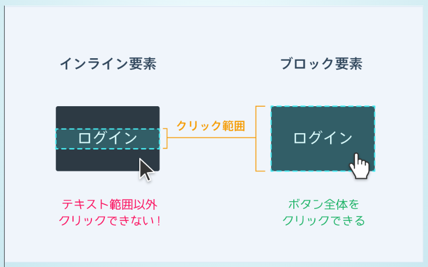
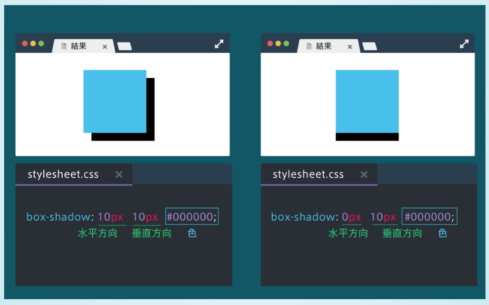
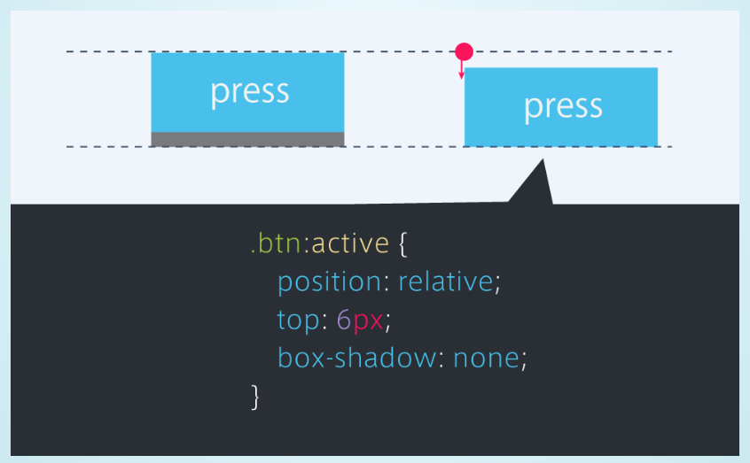
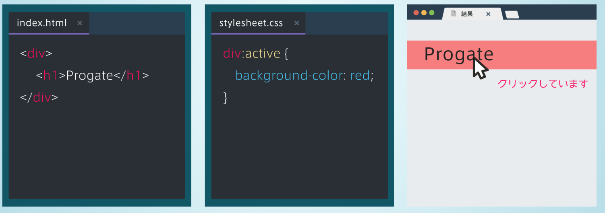
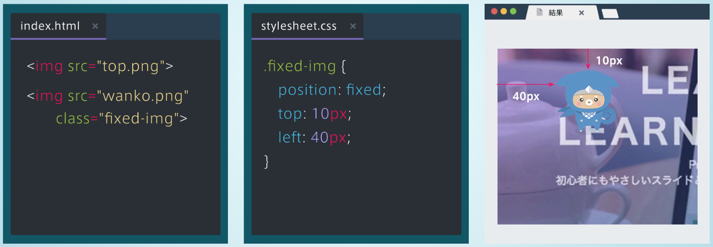
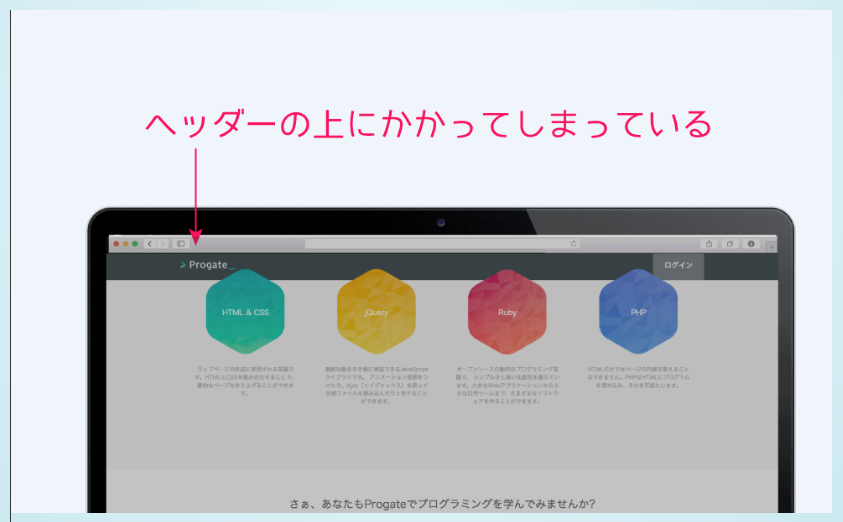
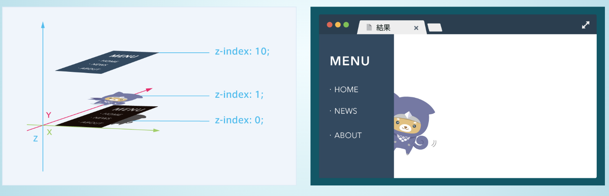

# header, footer
- class属性にheader, footerを指定するよりも、header, footerタグを使うほうが一般的。
```html
<div class="header"></div>
<header></header>

<div class="footer"></div>
<footer></footer>
```

# トップ画像の背景に画像を表示する
- cssで背景画像を指定するには、background-imageプロパティを使う
- 表示範囲を１つの画像で埋め尽くすように画像を拡大縮小するには、background-size: cover;とする
    - 指定しないと、画像サイズがそのまま表示されることになり、見た目が悪い。
```css
div {
    height: 200px;
    background-image: url(top.png);
    /* */
    background-size: cover;
}
```

# 要素を中央に配置する
- marginプロパティを使う
    - marginをautoにする
    - 必ずwidthとともに使う
    - 上下のmarginにautoは指定できない
```css
.box {
    width: 300px;
    margin: 0 auto;
}
```


# 文字を透過させる
- opacityプロパティを使う
    - 0.0（完全に透明）
    - 1.0（完全に不透明）

# 文字間の間隔を指定する
- letter-spacingプロパティを使う


# ボタンをつくる
- 今回はaタグで作ってみる
- ただしaタグはインライン要素なため、width, height等の細かいcssを適用できない
- displayプロパティを使うと解決できる
- display=block(ブロック要素), inline-block(インラインブロック要素), inline(インライン要素)


# カーソルが乗ったときのcssを指定する
- カーソルが乗ったときの状態をhoverという
- cssでセレクタ:hoverとすればよい


# 角に丸みをつける
- border-radiusプロパティを使う
- border-radius: ~~px;
- 数値が大きいほど角が丸くなる

# 要素の配置
- text-alignプロパティを使う
- left, center, right

# 要素を中央寄せにする方法
    1. marign: 0 auto;
        - 広い範囲を囲うようなブロック要素の場合に使う
    2. text-align: center;
        - テキストやボタンのようなインライン要素やインラインブロック要素の場合に使う


# アイコンを使う方法
- Font Awesomeを使うと便利
- 使い方
    1. font awesomeのcssファイルを読み込む
    2. spanタグをにfaクラスとfa-アイコン名クラスを指定する


# アニメーション
- transitionプロパティを使う
- 変化の対象と変化にかかる時間を指定する
- カーソルを乗せると背景が赤色に変化し、変化の対象を全てのプロパティにして一秒で変化させるには以下のように書く

```html
<div>
    <h1>Progate</h1>
</div>
```
```css
div {
    trainsition: all 1s;
}
div:hover {
    background-color: red;
}
```
- transitionは多くの場合、hoverと組み合わせて使う


# 行間を指定する
- line-heighプロパティを使う
- 値が大きいほど行間が大きくなる


# aタグをクリックできる範囲
- aタグはインライン要素のため、中身のテキストの部分しか大きさを持たない
- その結果、aタグをクリックできる範囲はテキストの部分だけになる
- aタグをブロック要素にする(display: block;)と、大きさが親要素いっぱいに広がることを覚えておく



# 文字の太さを変更
- font-weightプロパティを変更する normal, boldのどちらか
- hタグはデフォルトでbold


# 親要素に対して%で指定すると便利
- ボックスのwidth, heightをpxではなく%で指定すると、親要素に対してどのくらいの幅や高さを持つか指定することができる
```html
<div class="parent">
    <div class="child"></div>
    <div class="child"></div>
</div>
```
```css
.child {
    width: 50%;
}
```


# 画像の上に文字を重ねる方法
- position: absolute; を使うと要素同士を重ねて表示することができる
- サイト全体の左上部分を基準として、そこからの位置をtop, leftを用いて指定する。
- 親要素の左上位置に基準を持ってきたい場合は、親要素にposition: relative;　と指定すると、その要素の左上部分が基準位置となる。
```html
<div class="parent">
    <div class="child", src="./img.png"></div>
</div>
```

```css
.parent {
    position: relative;
}

.child {
    position: absolute;
    top: 20px;
    left: 40px;
}
```


# 立体的なボタンの作り方
- box-shadowプロパティを使う
- 以下の図のように影の位置と影の色を指定する


# ボタンを押したら凹むようにする
- 完成図

- 手順
    1. 影を消す
        - box-shadow: none;とする
        - 多くのプロパティはnoneを指定することで消すことができる
    2. ボタンの位置を影の分だけ下げる
        - 以下の指定によって、ボタンの位置を変える
        - position: relative; によって、ボタンが押されたタイミングで基準位置を変える。それにより、ボタンが沈み込んだように見せることができる。
        - top: 6px; によって、ボタンの沈み具合を指定することができる。
- 前提
    - セレクタにactiveを用いることで、要素をクリックされている間だけcssを適用することができる
    - セレクタ: active;とする



# ヘッダーの固定
- position: fixed;を使うと、常に要素を画面上の指定した位置に固定させておくことができる
- 位置は、top, right, bottom, leftを使って指定する



## 要素の重なり順を決める
### 問題点　
- positionを使用すると要素の重なりが生じる
- その結果、以下の図のように、レッスン紹介部分とヘッダーが重なったときに、ヘッダーが隠れてしまう。
- 重なり順を指定して、ヘッダーが上に表示されるようにする。


### 解決策
- z-indexプロパティを使用する
- 整数値で指定する。値が大きいほど上に表示される。
- z-indexは必ずpositionプロパティと併用する必要があることに注意する。

