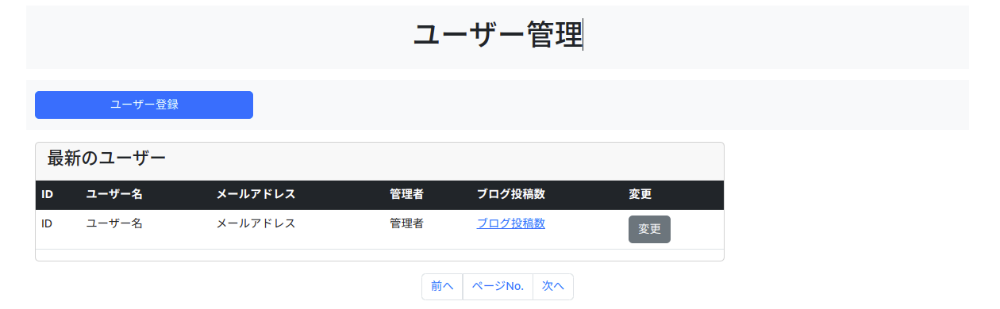
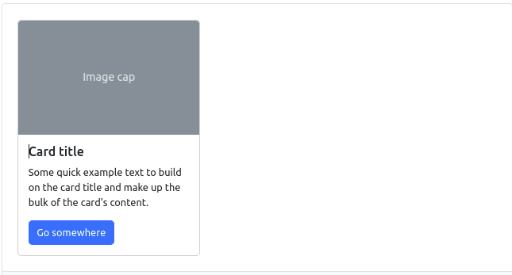

# 気になったことをメモ


## 完成ビュー


## header tag
- ページ上部に太字で表示させるならheaderタグを使用したほうがコードからヘッダーを示していることがすぐにわかる
- 太字にするのにh1タグを使用してfw-boldクラスを指定しなくてもいい
- m-autoをクラスに指定すると自動で水平方向に均等に配置してくれる。つまり中央に揃えてくれる。
```html
<header id="page-header">
  <div class="container my-3 py-3 bg-light">
    <div class="row">
      <div class="col-md-6 m-auto text-center">
        <h1>ユーザー管理</h1>
      </div>
    </div>
  </div>
</header>
```

## button tag
- buttonタグ内のtype属性にbuttonを指定しなくてもボタンとして表示される
```html
<section id="menu">
  <div class="container my-3 py-3 bg-light">
    <div class="row">
      <div class="col-md-3">
        <button class="btn btn-primary w-100">
          ユーザー登録
        </button>
      </div>
    </div>
  </div>
</section>
```
## card tag
- 参照：[bootstrap "card"](https://getbootstrap.jp/docs/5.3/components/card/)
- headersやfootersのオプション、多様なコンテンツ、背景色、表示オプションが含まれている
- つまりcardの中にいろいろな要素を入れることができる。

```html
<div class="card" style="width: 18rem;">
  
  <div class="card-body">
    <h5 class="card-title">Card title</h5>
    <p class="card-text">Some quick example text to build on the card title and make up the bulk of the card's content.</p>
    <a href="#" class="btn btn-primary">Go somewhere</a>
  </div>
</div>
```
