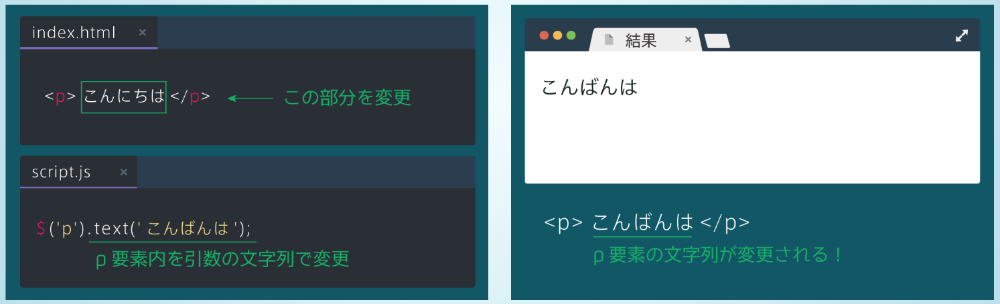

# jQueryとは
- javascriptのライブラリの１つ
- ユーザーのクリックに反応して表示されるフォームや、アニメーションなど、html, cssだけでは実現できなかった様々な動きを表現することができる。
- jQueryの操作は、先頭でjQueryオブジェクトを作成し、オブジェクトに対してメソッドを呼び出す。
    - セレクタには、HTMLのタグ名やclass名などを指定する
```javascript
$('セレクタ').メソッド(引数);
```

## 要素を隠す
- hideメソッドを使う
- 他にも様々な隠すメソッドが有る
    - fadeOut : 徐々に消えていくアニメーション
    - slideUp : 要素を隠す際に、下から上へスライドするアニメーション
```javascript
$('h1').hide(); // h1タグを隠す
$('h1').fadeOut(1000); // アニメーション速度を1000msに指定
$('h1').slideUp(1000);
```


## class, id
- classは１つのhtmlページ内で複数箇所で使うことができる
- idは１つのhtmlページ内で一度しか使えない
- classとidをセレクタにするには、class名の前には.をつけて、id名の前には#をつける
- idは同一ページに一箇所しか存在しないため、高速化のため、jQueryオブジェクトのセレクタにはできるだけidを使うようにすること
```html
<ul id="list">
    <li class="list-item">list1</li>
    <li class="list-item">list2</li>
    <li class="list-item">list3</li>
</ul>
```
```css
# list {
    margin: 10px;
}

. list-item {
    color: blue;
}
```

```javascript
$('#list').css('margin': '20px');
$('.list-item').css('color': 'red');
```

## 要素を表示する
- showメソッドを使用する
- cssにdisplayプロパティを使って、display: none; とすると要素を隠すことができるが、showメソッドを使えば表示することができる
- 他にも様々な表示するメソッドが有る
    - fadeIn : 要素を表示する際に徐々に表示するアニメーション
    - slideDown : 要素を表示する際に、上から下へスライドするアニメーション

```javascript
$('h1').fadeIn('slow'); // アニメーション速度をゆっくりに指定
$('h1').slideDown('slow');
```

## clickイベント
- イベントとは
    - イベントを用いると、ある処理を行うタイミングを設定できる
    - webページ内でユーザーによってクリックなどの操作が行われた時、予めイベント内に指定した処理を実行する
```javascript
$('selector').eventName(function() {
    // イベント発生時に実行したい処理　
});
```

### クリックされたら要素を隠す例
```html
<div id="hide-text">説明を隠す</div>
<p id="text">ボタンをクリックすると文章が隠れます</p>
```

```javascript
$('#hide-text').click(function() {
    // クリックされた時に#textを隠す
    $('#text').hide();
});


## cssメソッド
- cssを変更できるメソッド
- 第一引数にプロパティ、第二引数にプロパティの値を入れる

```javascript
$('selector').css('property', 'value')
```
```css
p {
    color: blue;
}
```
```javascript
$('p').css('color', 'red');
```

## HTMLを変更する
- textメソッド: HTMLそのものを変更することができる

- htmlメソッド: 要素の中身のHTMLを書き換えることができる


## this
- $(this)はイベントの中でそのイベントが起こった要素を取得することができる
- わかりにくいため、下の画像で使い方を確認


## jQuery高速化
### 変数を使う方法
- 同じjQueryオブジェクトを複数回使用するときは変数にする
- 高速化されると同時に、コードが見やすくなる


### メソッドチェーンを使う方法
- $('selector').method().method(). ...


## 子要素の取得
### findメソッド
- 全ての子孫要素（自分よりも下の階層の要素全て）の中から、指定したセレクタを持つ要素を取得したいときに用いる


### childrenメソッド
- 指定したセレクタが持つ子要素（一階層だけ下）の中から指定したセレクタに合致した要素を取得したいときに用いる


## hoverイベント
- 要素にマウスが乗った時や外れた時に指定した処理を行うイベント
- hoverメソッドは２つの引数が有ることに注意
```javascript
$('div').hover(
    function() {
        // マウスを乗せた時の処理
    },
    function() {
        // マウスを外した時の処理　
    }
);
```
