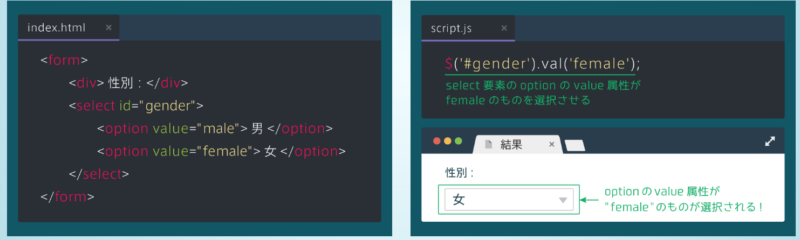

# jQueryとは
- javascriptのライブラリの１つ
- ユーザーのクリックに反応して表示されるフォームや、アニメーションなど、html, cssだけでは実現できなかった様々な動きを表現することができる。
- jQueryの操作は、先頭でjQueryオブジェクトを作成し、オブジェクトに対してメソッドを呼び出す。
    - セレクタには、HTMLのタグ名やclass名などを指定する
```javascript
$('セレクタ').メソッド(引数);
```

## 要素を隠す
- hideメソッドを使う
- 他にも様々な隠すメソッドが有る
    - fadeOut : 徐々に消えていくアニメーション
    - slideUp : 要素を隠す際に、下から上へスライドするアニメーション
```javascript
$('h1').hide(); // h1タグを隠す
$('h1').fadeOut(1000); // アニメーション速度を1000msに指定
$('h1').slideUp(1000);
```


## class, id
- classは１つのhtmlページ内で複数箇所で使うことができる
- idは１つのhtmlページ内で一度しか使えない
- classとidをセレクタにするには、class名の前には.をつけて、id名の前には#をつける
- idは同一ページに一箇所しか存在しないため、高速化のため、jQueryオブジェクトのセレクタにはできるだけidを使うようにすること
```html
<ul id="list">
    <li class="list-item">list1</li>
    <li class="list-item">list2</li>
    <li class="list-item">list3</li>
</ul>
```
```css
# list {
    margin: 10px;
}

. list-item {
    color: blue;
}
```

```javascript
$('#list').css('margin': '20px');
$('.list-item').css('color': 'red');
```

## 要素を表示する
- showメソッドを使用する
- cssにdisplayプロパティを使って、display: none; とすると要素を隠すことができるが、showメソッドを使えば表示することができる
- 他にも様々な表示するメソッドが有る
    - fadeIn : 要素を表示する際に徐々に表示するアニメーション
    - slideDown : 要素を表示する際に、上から下へスライドするアニメーション

```javascript
$('h1').fadeIn('slow'); // アニメーション速度をゆっくりに指定
$('h1').slideDown('slow');
```

## clickイベント
- イベントとは
    - イベントを用いると、ある処理を行うタイミングを設定できる
    - webページ内でユーザーによってクリックなどの操作が行われた時、予めイベント内に指定した処理を実行する
```javascript
$('selector').eventName(function() {
    // イベント発生時に実行したい処理　
});
```

### クリックされたら要素を隠す例
```html
<div id="hide-text">説明を隠す</div>
<p id="text">ボタンをクリックすると文章が隠れます</p>
```

```javascript
$('#hide-text').click(function() {
    // クリックされた時に#textを隠す
    $('#text').hide();
});


## cssメソッド
- cssを変更できるメソッド
- 第一引数にプロパティ、第二引数にプロパティの値を入れる

```javascript
$('selector').css('property', 'value')
```
```css
p {
    color: blue;
}
```
```javascript
$('p').css('color', 'red');
```

## HTMLを変更する
- textメソッド: HTMLそのものを変更することができる

- htmlメソッド: 要素の中身のHTMLを書き換えることができる


## this
- $(this)はイベントの中でそのイベントが起こった要素を取得することができる
- わかりにくいため、下の画像で使い方を確認


## jQuery高速化
### 変数を使う方法
- 同じjQueryオブジェクトを複数回使用するときは変数にする
- 高速化されると同時に、コードが見やすくなる


### メソッドチェーンを使う方法
- $('selector').method().method(). ...


## 子要素の取得
### findメソッド
- 全ての子孫要素（自分よりも下の階層の要素全て）の中から、指定したセレクタを持つ要素を取得したいときに用いる


### childrenメソッド
- 指定したセレクタが持つ子要素（一階層だけ下）の中から指定したセレクタに合致した要素を取得したいときに用いる


## hoverイベント
- 要素にマウスが乗った時や外れた時に指定した処理を行うイベント
- hoverメソッドは２つの引数が有ることに注意
- （例）あるdivタグのhoverイベントを適用したい場合の書き方

```javascript
$('div').hover(
    function() {
        // マウスを乗せた時の処理
    },
    function() {
        // マウスを外した時の処理　
    }
);
```

## jQueryファイルの読み込み
- jQueryは.js形式のファイルにコードを書く
- <script>はcssファイルの読み込みのように<head>タグの中にも書けるが、</body>タグの直前に書くことで、webページの表示速度をより早めることができる

- jqueryのコードは以下のように書く。

```javascript
$(function(){
    // この中にjQueryのコードを書く
});
```


## モーダルの表示非表示
### モーダルにする
1. モーダルをcssで非表示にする　
2. ログインボタンにclickイベントを設定
3. clickイベントでモーダルを表示

```css
.login-modal-wrapper {
    display: none;
}
```

```javascript
$('#login-show').click(function() {
    $('#login-modal').fadeIn();
});
```

## addClass
- addClassメソッドを用いると、指定した要素にクラスを追加することができる

```html
<p class="text-contents"></p>
```

```javascript
$('.text-contents').addClass('text-active');
```

## removeClass
- removeClassメソッドを用いると、指定した要素から指定したクラスを取り除くことができる
- 下の例は、text-contentsクラスについた要素から、text-activeというクラスを取り除いている

```html
<p class="text-contents text-active"></p>
```

```javascript
$('.text-contents').removeClass('text-active');
```

## this, findの使い方（復習）
- textクラスのクリックイベントを作成し、その中で、textクラス内のanswerクラスを変数化し、answerがopenというクラスを持っていれば、removeClassメソッドを用いて、answerからopenを取り除く。
- thisはイベント内で自分自身を意味する。
- hasClass内では、クラス名に.をつけない


```javascript
$('.text').click(function(){
    var $answer = $(this).find('.answer')
    if ($answer.hasClass('open')){
        $answer.removeClass('open');
    }else{
        $answer.addClass('open');
    }
});
```


## eqメソッド　
- jQueryオブジェクトの中から、eqの引数の数字と同じインデックス番号の要素を取得できる
- 下の例は、list3の色を赤にする例

```html
<ul>
    <li>list1</li>
    <li>list2</li>
    <li>list3</li>
</ul>
```

```javascript
$('li').eq(2).css('color', 'red');
```


## スライドの仕組み
- .slide要素はdisplay: none;を用いて基本的に表示されないようにし、activeクラスがついた.slide要素だけが表示されるようにする。


## removeClassについて復習
- 自分自身（クラス）を消すことができる
- 下の例は一行目のactiveクラスを削除するjqueryコード

```html
<div class="btn active">button1</div>
<div class="btn">button1</div>
<div class="btn">button1</div>
<div class="btn">button1</div>
```

```javascript
$('.active').removeClass('active');
```
- **removeClass, addClassは、activeにしたいタグにactiveクラスを追加したり(addClass)、非activeにしたいタグからactiveクラスを削除したり(removeClass)して使う。** 
- その際に、activeクラスのcssも設定しておく。
- 例えば、一番目のボタンだけ表示させたいときは次のようにする。

```css
<!-- ここで、全てのボタンを非表示にする -->
.btn{
    display: none;
}

<!-- activeクラスがついたボタンのみ表示する -->
.active {
    display: block;
}
```

- このようにcssを設定しておいて、activeクラスを削除や追加をする。


## indexメソッド　
- 下のコードのように、indexメソッドを用いると、li要素の中の.active要素のインデックス番号を取得できる

```html
<ul>
    <!-- インデックス番号1 -->
    <li>HTML</li>

    <!-- インデックス番号2 -->
    <li> class="active">CSS</li>

    <!-- インデックス番号3 -->
    <li>jQuery</li>
</ul>
```

```javascript
var index = $('li').index($('.active'));
```

- 応用として、clickイベントの中で、クリックされた要素のインデックス番号を取得してみると、次のようになる。

```html
<ul>
    <li>index 0</li>
    <li> class="active">index 1</li>
    <li>index 2</li>
</ul>
```

```javascript
$('li').click(function(){
    var clickedIndex = $('li').index($(this));
});
```

- $(this)はクリックした要素を意味している。
- **上のコードでは変数の前に$をつけていない理由は、格納するのが数値だから。ほかにも文字列のときも同様につけない。**
- **jQueryオブジェクトを格納するときはつける**

```javascript
var $div = $('div');
$div.css('color', 'red');
$div.html('jQuery');
$div.fadeOut();
```


- クリックした番号のスライドを表示する例

```html
<ul class="slides">
    <li class="slide active"></li>
    <li class="slide"></li>
    <li class="slide"></li>
    <li class="slide"></li>
</ul>
<div class="index-btn-wrapper">
    <div class="index-btn">1</div>
    <div class="index-btn">2</div>
    <div class="index-btn">3</div>
    <div class="index-btn">4</div>  
</div>
```

```css
.slide {
    display: none;
}

.active {
    display: block;
}
```

```javascript
$(function(){
    $('.index-bin').click(function(){
        // クリックされたらデフォルト表示を削除
        $('.active').removeClass('active');
        // クリックされたindex-btnクラスのインデックス番号を取得
        var clickedIndex = $('.index-btn').index(this);
        // インデックス番号に相当するスライドを表示
        $('.slide').eq(clickedIndex).addClass('active');
    });
});
```


## prev, nextメソッド　
- prevメソッドはjQueryオブジェクトの兄弟要素（同じ階層の要素）の中から１つ前の要素を、nextメソッドは１つ後ろの要素を取得することができる。


## textメソッド
- 文字列を置き換える、要素内の文字列を取得するという、２つの機能がある

```html
<h1>こんにちは</h1>
<p>Progate</p>
```

```javascript
// 文字列を書き換える場合
$('h1').text('こんばんは'); // h1要素内を引数の文字列に変更

// 文字列を取得する場合
var text = $('p').text(); // Progateを取得
```


- 他にも、jQueryで値をセットするメソッドは大抵取得もできる

```html
<div id="main">
    <h1>にんじゃわんこ</h1>
</div>
```

```css
h1 {
    font-size: 28px;
}
```

```javascript
// HTMLを取得する
var html = $('#main').html(); // #main内のhtmlである、「<h1>にんじゃわんこ</h1>」を取得

// CSSプロパティを取得する
var fontSize = $('h1').css('font-size'); // 28px
```


## attrメソッド
- HTMLの属性を取得、設定ができる
- 第一引数に属性名(href, idなど), 第二引数に属性値をいれる

```html
<h1>こんにちは</h1>
<a href="https://prog-8.com">リンク</a>
```

```javascript
// 属性をセットする場合
$('h1').attr('id', 'title');

// 属性値を取得する場合
$('a').attr('href'); // https://prog-8.com
```


## inputタグの入力値
```html
<form>
    <div>名前:</div>
    <input id="name" type="text">
</form>
```

```javascript
var name = $('#name').val(); // 入力欄に入力された値がはいる
$('#name').val('Akihiro'); // 入力欄に文字列をセットすることもできる
```

## submitイベント　
- フォームが送信された時のイベントとして、submitイベントがある。
- submitイベントを用いると、送信ボタンをクリックされたときだけでなく、Enterキーでフォームが送信された場合もイベントが発生する。

```javascript
$('form').submit(function(){
    // フォームの値を取得
});
```


## セレクトボックスの入力値
- selectタグを用いると選択肢式のセレクトボックスを作ることができる
- selectタグとoptionタグからなり、書くoptionタグが選択肢になる
- inputタグと同様に、valメソッドで選択中の値を取得できる


## セレクトボックスの自動入力
- selectタグもvalメソッドを用いて自動で選択させることができる
- 先程のinputタグとの違いは、selectタグの場合、選択肢が限定されてしまうこと
- optionタグのvalue属性に合致する値をvalメソッドの引数に指定する 



## カスタムデータ属性
- 属性は自分で作ることができ、これをカスタムデータ属性という。
- 「data-」から始まる属性名を自由に設定できる。
- **data属性は何らかの情報をHTML内に指定しておくのに便利なため、jqueryではよく使われる。**


## アニメーションをつける animateメソッド　

```javascript
// 第一引数に、変更するプロパティと変更後の値
// 第二引数に、アニメーションのミリ秒
$('h1').animate({'font-size': '50px'}, 1000);
```


## ページ内リンク
- ブログなどの縦に長いページでは、「トップに戻る」といった名前でページの最上部に戻れるボタンが設置されていることがある
### aタグでのページ内リンク
- リンクの飛び先にidを指定し、<a>タグのhref属性に"#id名"とすると、<a>タグをクリックすると、そのidの要素が表示されている場所まで移動することことができる。

```html
<!-- hrefの値を、"#+id名"とする。 -->
<a href="#contact">
</a>
<div id="contact">
</div>
```

### scrollTopメソッドによるページ内リンク
- $('html, body').scrollTop(値); のように指定し、ページ最上部から値pxの位置に移動することができる
- **通常、scrollTopは$('html, body')に対して用いるため、セットで覚えておく**
```javascript
$('#top-btn').click(function(){
    $('html, body').scrollTop(0); // スクロールされている部分の距離が0 = ページの最上部
});
```

## スクロールにアニメーションをつけてみる
```javascript
$('html, body').animate(
    {'scrollTop': 0}, // 変更するプロパティ、値
    'slow' // アニメーションの速さ
);
```


## ページ内ナビゲーションを作る
### offsetメソッド
- 要素の表示位置を取得できる
- 下図の右のように、ページの上端からの距離とページの左端からの距離が連想配列の形で返す
- offset().topとすると、ページの上端からの距離を取得できる


### attrメソッドで飛び先を取得する


```html
<header>
...
    <ul class="header-menu-right">
         <li>
           <a href="#stamps">LINEスタンプ</a>
         </li>
         <li>
           <a href="#interview">インタビュー</a>
         </li>
         <li>
           <a href="#contact">お問い合わせ</a>
         </li>
    </ul>
...
```

```javascript
$('header a').click(function(){
    // クリックしたaタグのhref属性の値を取得する
    var id = $(this).attr('href');

    // 取得したhref属性の位置を取得する
    var position = $(id).offset().top;

    // 移動する(ここではアニメーションをつける)
    $('html, body').animate({'scrollTop': position}, 500);
});
```
