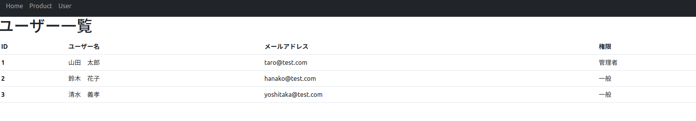

# memo
## Usage of render_template, extends and url_for
- url_for('function')の形式で例えばaタグのhref属性に{{}}で囲うと、functionのデコレータ@app.route('path')のpathがhref属性に自動的に挿入され、functionが実行される。
- 以下のコードで説明する。
- やりたいことは、Homeボタンを押して'hello Akihiro'と表示させること
- 仕組み解説
    1. path / のリンクでindex関数が実行される
    2. render_templateでindex.htmlが表示される
    3. base.htmlがextendsで継承されているため、base.htmlが実行される
    4. navバーが表示されHomeボタンを押すと、'index'関数が指定されているため、デコレータでルーティングしたリンク'/'が'index'の代わりに挿入される。href="/"となる。
- ポイント
    - extendsを使えば、htmlからhtmlを継承できる。再利用可能。
        - 継承するときは、の形式で書く。
        - 継承元を上書きするときは、との間に新たなコードを書く。
    - url_forを使えば、ルーティングしたリンクが変更されても動作に影響を受けない。動作を変えずにリンクを適宜変更できる。
        - 下のコードでindex関数が呼ばれるリンクを'/'から'/index'としてもindex関数が実行される。
    - templatesフォルダを用意する
        - base.html, index.html等のpythonで制御するhtmlファイルは、app.pyと同じディレクトリにtemplatesディレクトリを作成し、その中に保存する。
        - templatesディレクトリの中に格納すれば、render_template関数内に書くpathは'index.html'のように書ける。
        - templatesディレクトリの中に別のディレクトリ(error_pages等)を作成し、その中に制御したいhtmlファイル(404.html等)が有るときは、render_template関数内に、'error_pages/404.html'とかく。

```html
<!-- base.htmlの一部 -->

<a class="nav-link" href="{{url_for('index')}}">Home</a>
```

```html
<!-- index.html -->





<h1>hello {{user_name}} !</h1>


```

```python
# app.py

from Flask import flask, render_template

app = flask(__name__)

@app.route('/')
def index():
    user_name = 'Akihiro'
    return render_template('index.html', user_name=user_name)
```
## Usage of 'for' and 'if' in html file
- 完成図
- 
- code
```html




<h1>ユーザー一覧</h1>
<table class="table">
  <thead>
    <tr>
      <th scope="col">id</th>
      <th scope="col">ユーザー名</th>
      <th scope="col">メールアドレス</th>
      <th scope="col">権限</th>
    </tr>
  </thead>
  <tbody>
    <!-- usersはpythonファイルから受け取っている変数 -->
    
    <tr>
      <th scope="row">{{user[0]}}</th>
      <td>{{user[1]}}</td>
      <td>{{user[2]}}</td>
      
        <td>管理者</td>
      
        <td>一般</td>
      
    </tr>
    
  </tbody>

```
- ポイント
    1. trタグを繰り返さずfor文を使っている。
    2. for, if文を使うときは、 ~ ,  ~ と記述する。
    3. インデントは必須
    4. html内部で変数を参照するときは、{{variable}}と書く。
